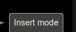
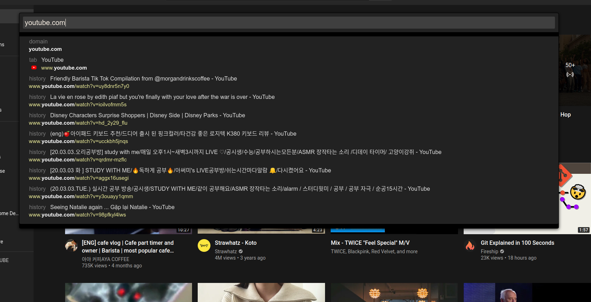
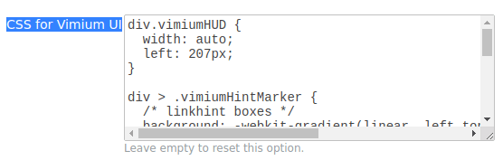

# Vimium Dark Theme

## Note

- I use Crontab + auto commit script (used API whatthecommit.com), so my commit just auto sync, => sorry I'm so lazy to commit :D

## Look like this

## 

## 

## 

## Install

Vimium options >> copy and paste from **CSS_for_vimium_UI.css** into CSS for vimium UI

## Q & A

**Who am I?**

- I'm noob, just that

## Stargazers over time

